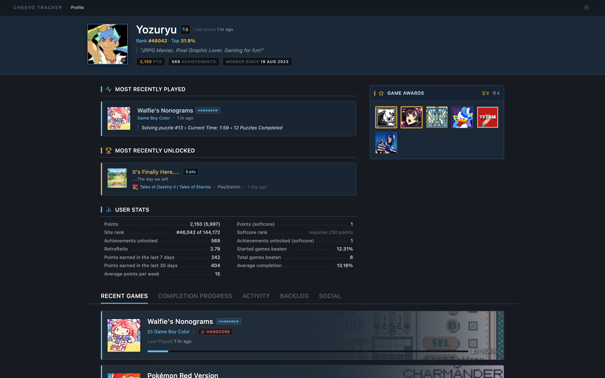
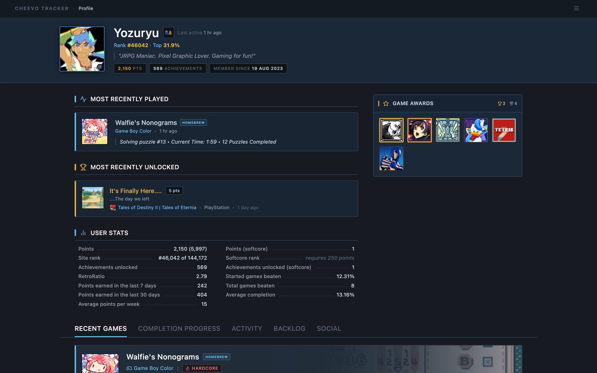
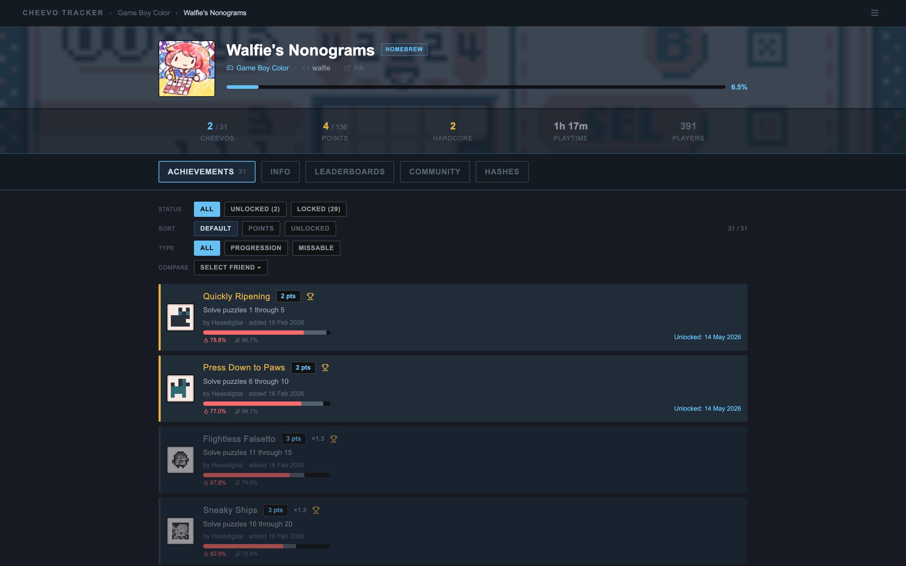
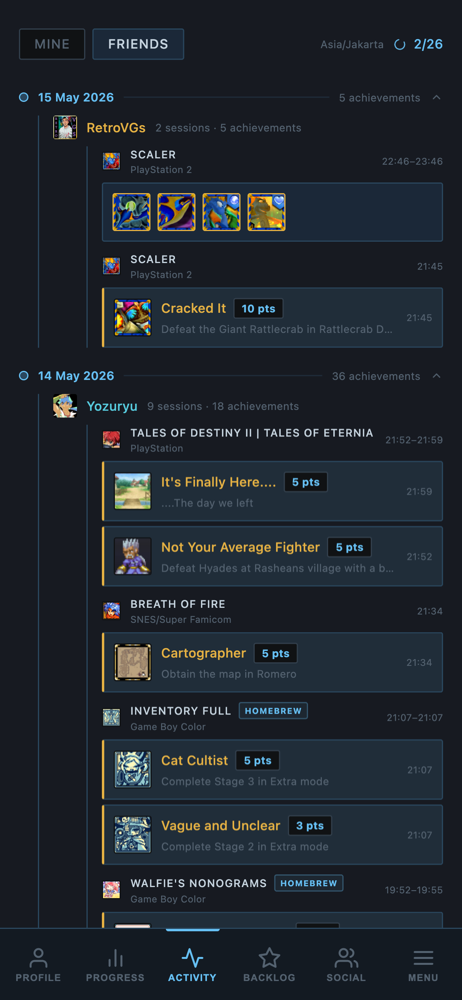
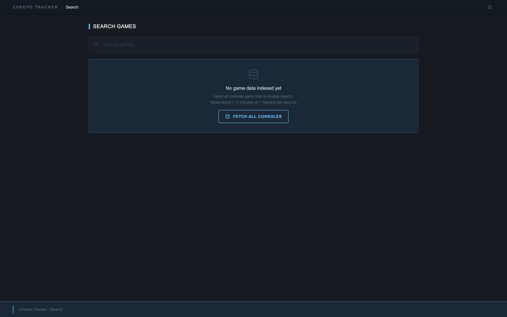

<div align="center">

# Cheevo Tracker

**Personal [RetroAchievements](https://retroachievements.org) profile tracker — no server, no build step, runs entirely in your browser.**

[](LICENSE)
[](https://web.dev/progressive-web-apps/)
[](#tech-stack)
[](#)
[](https://react.dev)
[](https://tailwindcss.com)

**[→ Try it live](https://yozuryu.github.io/cheevo-tracker/)**



</div>

---

## What it is

Cheevo Tracker is a client-side web app that connects to the [RetroAchievements API](https://api-docs.retroachievements.org/) using your own credentials. It gives you a richer view of your profile, friends, and game library than the official site — with no account to create, no server to run, and no build pipeline to maintain.

<details>
<summary><strong>Full feature list</strong></summary>

### Profile & Progress
- **Achievement heatmap** — full-year calendar showing daily unlock activity at a glance
- **Completion progress** — per-game progress bars across your entire played library, filterable by status
- **Series tracker** — groups games by franchise and shows combined completion across the series
- **Awards & milestones** — mastery badges, beaten records, and points history in one view

### Activity & Social
- **Timezone-aware activity feed** — Mine and Friends tabs grouped by local day and user; never shows wrong dates near midnight
- **Friends feed** — sessions grouped by user within each day; sessions with many unlocks collapse to a scannable icon strip, expanding on tap
- **Playing Now indicator** — subtle live dot on friends who earned achievements in the last 30 minutes

### Backlog
- **Wishlist management** — tag any game to your backlog directly from the game page
- **Filter, group, and search** — filter by status (Not Started / In Progress / Mastered), group by console or status, full-text search
- **Paginated list** — handles large backlogs without performance degradation

### Game Search
- **Cross-console search** — fetches and indexes every console's full game list into a permanent local store
- **Instant results** — live-filtered as you type across tens of thousands of games, paginated at 50 per page
- **Persistent index** — data survives page reloads and is only refreshed when you explicitly ask

### Game Pages
- **Achievement list** — with friend comparison showing who in your friends list has earned each achievement
- **Leaderboards** — ranked scores with your personal entry highlighted
- **Community** — recent masters and forum comments without leaving the tracker
- **ROM hashes** — supported hash list for each game

### App & Platform
- **Mobile-friendly** — responsive layout throughout; bottom navigation bar, slide-up menu sheet, and touch-optimised interactions on every page
- **PWA installable** — add to home screen on iOS and Android; works like a native app
- **Offline support** — service worker caches all assets; previously loaded data available without a connection
- **Privacy first** — your credentials live only in your browser's `localStorage`; nothing is sent anywhere other than the official RA API

</details>

---

## Screenshots

| Profile | Game Page |
|:-------:|:---------:|
|  |  |

| Friends Feed | Search |
|:-----------:|:------:|
|  |  |

---

## Getting Started

You need a [RetroAchievements](https://retroachievements.org) account. Your API key is on the [Settings page](https://retroachievements.org/settings) under **Keys**.

### Run locally

```bash
git clone https://github.com/yozuryu/cheevo-tracker.git
cd cheevo-tracker
npx serve .
```

Open `http://localhost:3000`, enter your RA username and API key, and you're in.

> `file://` also works in most browsers if you just want to open `index.html` directly without a server.

### Deploy to the web

The entire app is static files — deploy it anywhere:

| Host | How |
|------|-----|
| **GitHub Pages** | Push to `main`, enable Pages in repo Settings → Pages |
| **Netlify** | Drag the project folder onto [app.netlify.com](https://app.netlify.com/drop) |
| **Vercel** | `npx vercel --prod` in the project directory |
| **Cloudflare Pages** | Connect repo, build command: _none_, output directory: `/` |

No build command needed — point the host at the repo root and you're done.

---

## Tech Stack

<a name="tech-stack"></a>

| | Technology |
|---|---|
| UI framework | React 18 via CDN — no bundler |
| Styling | Tailwind CSS via CDN |
| Icons | Lucide React |
| JSX transform | Babel Standalone (in-browser) |
| Offline | Service Worker + Cache API |
| Data source | [RetroAchievements API](https://api-docs.retroachievements.org/) |

No npm. No Node. No build pipeline. Every file is plain HTML and JavaScript you can open and read directly.

---

## Privacy

All data is fetched from the [RetroAchievements public API](https://api-docs.retroachievements.org/) directly from your browser using your own API key. Nothing is ever sent to an external server — credentials, cached API responses, and the game search index all live exclusively in your browser's `localStorage` and `sessionStorage`.

---

## License

[MIT](LICENSE)
